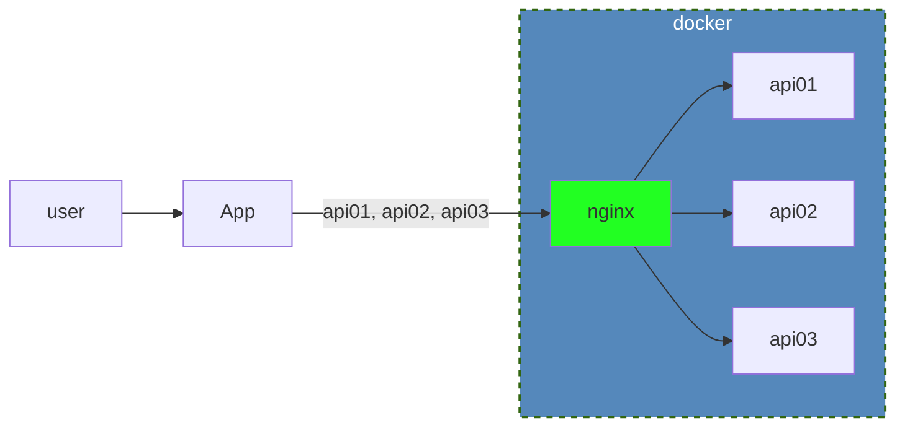

# API-Proxy

## Основная концепция

Реализация данного проекта преследует несколько целей:

- командная работа над проектом
- реализация на FastAPI (асинхронная обработка запросов к сторонним сервисам, REST API, работа с очередями, Vue.JS для _frontend_ части)
  
Сервис имеет возможность обращаться к нескольким к одинаковым по структуре сторонными API. При запросе от пользователя запрос дублируется на все необходимые API, полученные от них ответы собираются в один для представления пользователю.

Например, при получении запроса от клиента через форму с полями `name="Иван" sname="Иванович" lname="Иванов"` эти значения используются для обращения к сторонним API (идентичным, только подключенным к разным базам): `http://srv1/rest-api/query?name=Иван&otch=Иванович&fam=Иванов` и/или через POST запросы, полученные ответы консолидируются и выдаются в общей таблице пользователю

## Этапы работы над проектом

- [ ] __Сделать сервисы-"заглушки" с фиксированными данными для иммитации сервисов API__

<details>
  <summary>часть из имеющегося API, которую потребуется имитировать на первом этапе</summary>
```yml
  /rest-api/clients/search-zakf:
    post:
      tags:
        - Поиск физических лиц
      description: Поиск карточек ФЛ
      requestBody:
        required: true
        content:
          application/x-www-form-urlencoded:
            schema:
              type: object
              properties:
                fio:
                   type: string
                   description:  ФИО заявителя
                mobile:
                   type: string
                   description: Мобильный телефон (формат +79885446884)
      responses:
        '200':
          description: Ответ
          content:
            application/json:
              schema:
                type: object
                properties:
                  fio:
                    type: string
                    example: Иванов Иван Иванович
                    description: ФИО
                  fam:
                    type: string
                    example: Иванов
                    description: Фамилия
                  nam:
                    type: string
                    example: Иван
                    description: Имя
                  otch:
                    type: string
                    example: Иванович
                    description: Отчество
                  tel:
                    type: string
                    example: 8 8634211111
                    description: Стационарный телефон
                  telmob:
                    type: string
                    example: +7 (999) 999 99 99
                    description: Мобильный телефон
                  inn:
                    type: string
                    example: 614000000000
                    description: ИНН
                  cnils:
                    type: string
                    example: 999-999-999 99
                    description: СНИЛС
                  adr:
                    type: string
                    example: Ростовская обл.....
                    description: Адрес регистрации
                  fadr:
                    type: string
                    example: Ростовская обл.....
                    description: Адрес проживания
        '400':
          description: Обработанная ошибка
          content:
            application/json:
              schema:
                $ref: '#/components/schemas/error400'
        '500':
          description: Ошибка выполнения программы
          content:
            application/json:
              schema:
                $ref: '#/components/schemas/error500'
  /rest-api/clients/search:
      post:
        tags:
          - Поиск физических лиц и их заявок
        description: Поиск карточек ФЛ
        requestBody:
          required: true
          content:
            application/x-www-form-urlencoded:
              schema:
                type: object
                properties:
                  fio:
                     type: string
                     description:  ФИО заявителя
                  mobile:
                     type: string
                     description: Мобильный телефон (формат +79885446884, +7(988)5446884, 79885446884, 7(988)5446884), стационарный телефон(формат 8 9999999(сколько угодно цифр) или 99999(сколько угодно цифр))  
                  dr:
                     type: string
                     description: Дата рождения (формат 31.12.1999)
        responses:
          '200':
            description: Ответ
            content:
              application/json:
                schema :
                  type : object
                  properties :
                    data:
                        type : array
                        description : Список не закрытых дел
                        items :  
                          type : object
                          properties :
                                fio :
                                  type : string
                                  example : Иванов Иван Иванович
                                  description : ФИО
                                fam:
                                  type : string
                                  example : Иванов
                                  description : Фамилия
                                nam:
                                  type : string
                                  example : Иван
                                  description : Имя
                                otch:
                                  type : string
                                  example : Иванович
                                  description : Отчество
                                tel:
                                  type : string
                                  example : 8 8634211111
                                  description : Стационарный телефон
                                telmob:
                                  type : string
                                  example : +7 (999) 999 99 99
                                  description : Мобильный телефон
                                email:
                                  type : string
                                  example : everyone.likes@candyes.ru
                                  description : Почта
                                adr:
                                  type : string
                                  example : Ростовская обл.....
                                  description : Адрес регистрации
                                fadr:
                                  type : string
                                  example : Ростовская обл.....
                                  description : Адрес проживания
                                active_cases:
                                  type : array
                                  description : Список не закрытых дел
                                  items :  
                                      type : object
                                      $ref: '#/components/schemas/findedCase'
                                zapis:
                                  type : array
                                  description : Список талонов предварительной записи на будущее время
                                  items :  
                                      type : object
                                      properties :
                                          id :
                                             type : integer
                                             description : id талона предварительной записи
                                          npp :
                                             type : string
                                             example : П23
                                             description : номер талона предварительной записи
                                          dt :
                                             type : string
                                             example : 2021-05-05 15:38:00
                                             description : дата, время на которе записался заявитель
                                          idq :
                                             type : integer
                                             description : id электронной очереди
                                last_case:
                                      type : object
                                      $ref: '#/components/schemas/findedCase'
          '400':
            description: Обработанная ошибка
            content:
              application/json:
                schema:
                  $ref: '#/components/schemas/error400'
          '500':
            description: Ошибка выполнения программы
            content:
              application/json:
                schema:
                  $ref: '#/components/schemas/error500'
```
</details>

Предлагаю использовать docker compose, в составе которого будет nginx и несколько копий одинакового приложения, с различием в иммитации БД.
В конфигурации nginx использовать проксирование в сторону fastAPI сервисов



- [ ] __Основной сервис, который при обращении пользователя к нему, будет с использованием aiohttp делать запросы по всем доступным API (из конфига), обрабатывать получаемый от них результат и возвращать пользователю в консолидированном виде__

- [ ] __Пользовательский интерфейс с формой для передачи параметров__

### TODO:
- отдельный фрон на Vue.js
- работа с очередями (складывать задачу от пользователя в очередь, после выполнения выдавать всплывашку о готовности результата)
- 